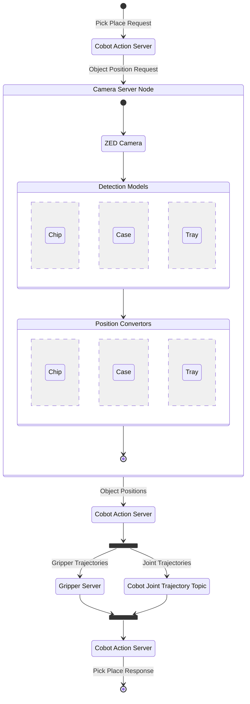
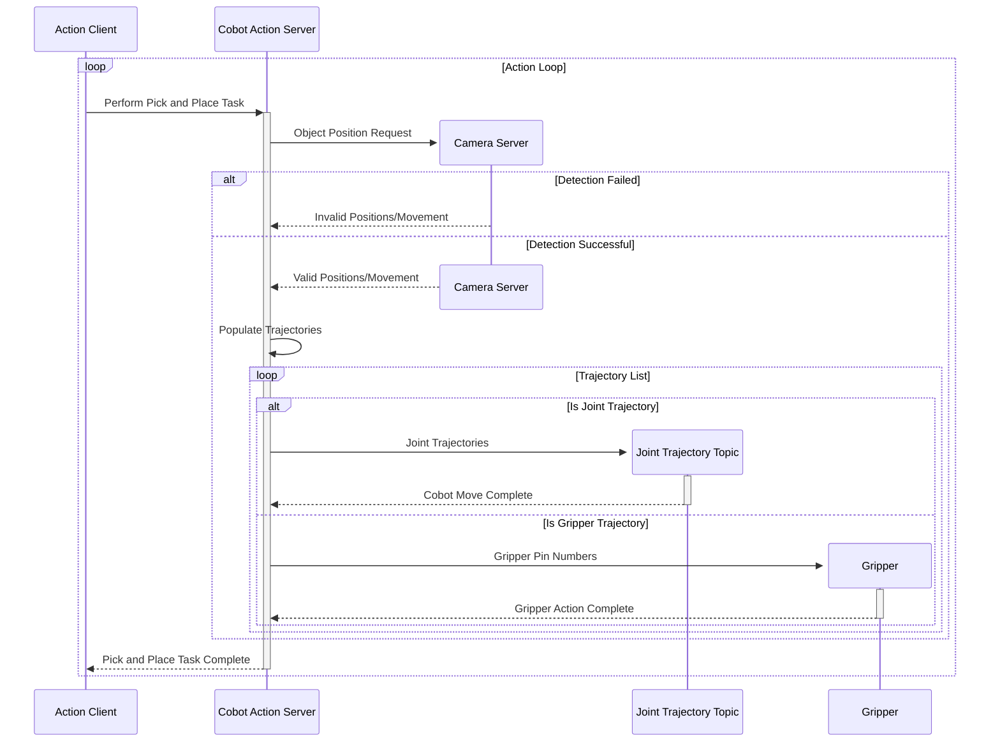

<link rel="stylesheet" href="../styles/styles.css" type="text/css">

# Robot Vision System For A Pick And Place Task
<!--
	Co-Author: @dau501
	Editor(s): @NickMcK14, @finnmcgearey, @Slothman1, @Huy-GV
	Year: 2023
-->

`Detailed System Design and Implementation Report`

## Industry Project 24
|Name|Position|Email|
|:-|:-|:-|
|@Slothman1|Team Leader/Client Liaison|id@swin.student.edu.au|
|@dau501|Development Manager/Planning Manager|id@swin.student.edu.au|
|@finnmcgearey|Support Manager/Developer|id@swin.student.edu.au|
|@vkach|Quality Manager/Developer|id@swin.student.edu.au|
|@NickMcK14|Support Manager/Developer|id@swin.student.edu.au|
|@Huy-GV|Quality Manager/Developer|id@swin.student.edu.au|

<!-- page break -->

# DOCUMENT SIGN OFF
|Name|Position|Signature|Date|
|:-|:-|:-|:-|
|@Slothman1|Team Leader/Client Liaison|student_signature(&emsp;)|DD/MM/2023|
|@dau501|Development Manager/Planning Manager|student_signature(&emsp;)|DD/MM/2023|
|@finnmcgearey|Support Manager/Developer|student_signature(&emsp;)|DD/MM/2023|
|@vkach|Quality Manager/Developer|student_signature(&emsp;)|DD/MM/2023|
|@NickMcK14|Support Manager/Developer|student_signature(&emsp;)|DD/MM/2023|
|@Huy-GV|Quality Manager/Developer|student_signature(&emsp;)|DD/MM/2023|

# CLIENT SIGN OFF
|Name|Position|Signature|Date|
|:-|:-|:-|:-|
|@FelipMarti|Research Fellow| |&emsp;/&emsp;/2023|

|Organisation|
|:-|
|Swinburne's Factory of the Future    |

<!-- page break -->

# Introduction
Project 24, aims to enhance a collaborative robot (cobot) by developing and
implementing a perception system for pick-and-place tasks in the Factory of the Future (FOF).
Currently, the cobot operates on predefined positions, limiting its capabilities.
The goal is to enable the cobot to autonomously identify and locate electronic components using computer vision and artificial intelligence.

Utilising state-of-the-art technologies in computer vision, sensors, robotics, and artificial intelligence,
the project will develop a real-time object detection, processing, and analysis system.
This system will continuously learn and adapt to its environment, enhancing the cobot's capabilities.

This document serves as a comprehensive design of the project and overall implementation planned.
It aims to provide sufficient information for clients and project leads, ensuring easy understanding of the system's design and implementation of Project 24.

## Overview
This document records the technical details, considerations and design strategies employed to build the system.
It aims to provide guidance and serve as a valuable reference for developers involved in the implementation,
while also offering insightful information to relevant stakeholders.
It also covers deeper details of the system architecture described in the SADRR by providing a comprehensive UML class diagram,
which encapsulates the hierarchical relationships and interdependencies between various classes and components.
The document also discusses the verifications for said design and systematically examines how established requirements and common use cases are achieved.

## Definitions, Acronyms and Abbreviations
The following definitions will be used consistently throughout the SRS document to ensure clarity and understanding:
* **cobot:**
The mechanical device (UR5e manufactured by Universal Robots) used to perform pick and place tasks.
* **CV/Perception System:**
Computer Vision (CV) is the technology used to provide the robot with visual feedback of the environment.
* **Sensors/Depth Camera:**
The device (ZED 2 Camera developed by Stereolabs) used to detect the presence of objects and provide feedback to the robot.
* **AI:**
Artificial intelligence, the technology used to provide the robot with the ability to learn and improve its performance.
* **ROS2:**
Robot Operating System 2, a framework for building robot software applications.
* **ML:**
Machine learning, A type of AI where the computer learns.
* **OS:**
Operating System.
* **Project 24:**
The shorter alternative name of this project.\
The full name is *Robot Vision System For A Pick And Place Task*.
* **HeeHooVision:**
The name for the Capstone Team working on Project 24

<!-- page break -->

## Assumptions and Simplifications
When developing the system design for this project,
the following assumptions were made to further narrow down the scope of the project and ensure that it was feasible:
* The system will not have to account for parts that are not in their assigned locations.\
However, the system will have to halt when an object is detected and found to obstruct the cobot in completing its task.
* The fine motor controls for the cobot is already completed and accurate.\
As such, no development will need to be made to derive and implement transfer functions.
* The tools and software used in the project (i.e., Depth Camera, cobot, and ROS2) are not subject to change.
* The types of objects the cobot will interact with are not subject to change.
* The locations of where the cobot will have to pick up objects is not subject to change.
* The locations of where the cobot will have to place objects is not subject to change.
* Objects that are almost identical, such as the PCB parts, will have labels to distinguish between different types,
such as the PCB for a barometer vs. a thermometer.

To ensure that the system that is being developed is feasible and able to be completed in the allotted time,
some aspects of the problem space have been designed to simplify the developmental process.

These aspects are as follows:
* The locations of parts that that the cobot will have to pick and place are predetermined.\
Therefore, the Depth Camera does not need to 'search' for parts, rather just check if a part is in a predetermined location.
* The cobot will only be allowed to perform a pick and place task if a part is in one of the predetermined locations.
* The individual parts that the cobot will have to pick and place will be color coded,
ensuring that the Depth Camera will be able to effectively differentiate between the required parts and the surrounding environment.

<!-- page break -->

# System Architecture Overview

<!--  -->

Multiple pieces of software are required for the cobot to successfully complete the pick and place task.
These components consist of the perception system to perceive the environment and provide visual data, and
the software system that utilises computer vision and machine learning to detect the objects.
Once the cobot has performed a movement, the environment will have changed,
which provides new visual data to be passed into the perception system to continue the cycle.

<!-- page break -->

The flow of data is shown to pass through multiple interfaces, from the user interface to the software interface to the hardware interface.
ROS2 is utilised to allow for the visual data to be passed into ROS2 interfaces which allows for the data to be easily used within ROS2 programs and
therefore to perform actions.

<!--  -->

<!-- page break -->

# Detailed System Design
## Architecture
The high level architecture is captured in the below diagram, depicting the flow of a pick-and-place request through the core components.
Note that components with the same name reference the same entity, the duplication is intended to maintain a clear direction of a request through these components.
As the cobot is intended to perform indefinitely in a loop, a client node continuously sends a request to the action server;
however, it is omitted from this diagram for brevity.

Every request to perform a pick-and-place action will trigger an image capture on the ZED camera,
the result of which will be used as an input to the relevant AI model to retrieve positions of objects.
These positions are then used to build a list joint trajectories or gripper trajectories, each of which control different parts of the cobot.
The communication protocol between the joints that control the cobot movements and
the gripper differs in that the joints trajectories are published to a topic whilst the gripper action is controlled by a separate node.
Despite this difference, joints and gripper actions are performed together to ensure a smooth cobot operation.

## Design Verification
The following sequence diagram offers a visual representation of how the implemented system complies with the project requirements.
It shows the interactions between main components and the continuous flow of operations between them, including branched paths where relevant.

The diagram depicts the sequence of requests made between components.
The outer loop represents an infinite request loop made by the client,
where it initiates a pick-and-place task with the server, waits until the server completes and respond, then sends a request again.
The 'alt' block represent alternative sequences based on a condition.
If the request to the Camera Server fails, the Cobot Action Server stops and responds to the client.
Conversely, if successful, it starts populating a list of trajectories,
loop over that list and either publish them to the Joint Trajectory Topic or sends a request to the Gripper Server.
Services within the Camera Server are omitted for brevity, certain return paths where the server fails due to various reasons are also excluded.

### Real-time Object Detection
The depth camera stay open and capture images immediately upon a request, and the resulting picture is processed by the relevant detection model.
The result is then converted to a single number representing the position of an object as defined by the Cobot, or the suggested tray move.
This verifies that the system enables real-time object detection and analysis, ensuring accuracy, speed and ease of communication between various components.

### Object Location Data Communication
The object positions detected by the neural network are communicated from the Camera Server to the Cobot Action Server which controls the cobot movement.
The Action Server utilizes this information and builds a list of joint/gripper trajectories that moves the cobot to pick a specified item.
This verifies that the system exhibits communication between the AI models and the cobot, enabling a highly accurate and precise pick-and-place cycle.

### Autonomous Systems
The sequence diagram shows the continuous operation of the system without the need for human intervention.
The robotic arm moves to the detected object positions automatically based on requests from an action client which runs in an infinite loop.
By minimising human involvement, the system fulfils the requirement of an autonomous system.

<!-- page break -->

# Implementation
Due to the project requiring the group to learn an entirely new set of skills,
the start of the project has exclusively involved completing background research in the relevant fields.
This includes research into ROS2, Machine Learning, and Computer Vision.

## ROS2
ROS 2 consists of multiple software libraries for developing robotics software.
It allows for structuring the different components of the robot system into a graph containing nodes, topics, services, and actions.
Commands can be used within a terminal to control different aspects of ROS and it supports programming in C++ and Python.

### Nodes and Topics
Nodes represent a single, modular purpose.
For example; publishing information from a camera, moving grasping claw, moving arm motors, rotating claw, etc.
Nodes have parameters that can be set or changed via CLI or in code.

Topics are used to connect nodes.
Nodes can subscribe to topics and receive data or publish to them by sending data.
For example; a vision camera publishes object positions to a topic, relevant nodes subscribe to receive the position data and
then use it to move the arm to that position.

### Services and Actions
Services are another way to connect nodes.
A client node can send a request message containing some data to a server node.
The server node then sends a response message containing some data back to the client node.
Services can be used to confirm data is correct or for other nodes to modify data for the client node to use.

Actions are a way to connect nodes to allow for the robot to perform an action.\
Actions can be cancelled unlike topics and services and they consist of three parts:
1. Goal service
	* Client sends the goal required
	* Server sends acknowledgment
2. Result service
	* Client sends request for result
	* Server sends feedback until goal is reached
	* Server sends result
3. Feedback topic
	* Server sends gradually changing data
	* Feedback stops once goal is reached

<!-- page break -->

### Bags
Bags are used for recording and playing back data published to topics.
Once data is recorded in a bag, it can be used to perform actions again in the exact same way which is useful for debugging and troubleshooting.

### Proposed Implementation
Each distinct part of the robot system that moves will need to be represented as a node.
This includes but is not limited to the grasping claw, robot arm motors, vision camera and nodes for performing actions or invoking services.
Any movements or tasks will be performed via an action, this will include;
closing grasping claw, picking up distinct objects, placing objects, resetting position, etc.
Simulations will be used to test tasks before running them on the physical robot and to allow for better development remotely.

### Integration
All code written to control the robot will use ROS 2 libraries.
Code created in C++ and Python will use the rclcpp and rclpy libraries respectively.
The modularity of ROS allows for much easier integration with the object detection software that will be created.
Nodes related to the vision camera can utilise the object detection program to allow the robot to move to the correct positions and
perform actions efficiently and accurately.

## Machine Learning
### Structured Data
* Typically quantitative data.
* Highly organised and easily decipherable.
* SQL can and usually is used to manage structured data.

### Unstructured Data
* Typically qualitative data.
* Needs special tools to be processed and analysed.
* Best stored in non-relational databases.

### Semi-Structured Data
* A bridge between the two.
* Has metadata to have better organisation.

### ML Methods
* Supervised
* Unsupervised
* Semi-Supervised

<!-- page break -->

## Computer Vision
The perception system will be able to identify objects and their locations with a great deal of accuracy thanks to the Depth Cameras use of binocular vision,
which works similarly to human eyes depth perception.
Its 120-degree field of view and depth range of 0.2 to 20 metres give it a large detection area and enables better tracking of object positions.

The Depth Camera can record video at a variety of frame rates and resolutions,
including 2.2K at 15 fps, 1080p at 30 fps or 15 fps, and 720p at 60, 30 or 15 fps.
Higher frame rates would enable better position tracking, while higher resolutions would improve object detection.

With this in mind he project will require a system that is composed of the following items:

### Input Data Validator
The Depth Camera will likely output complex and possibly unprocessable visual data.
Data must be passed to this sub-component to check for proper formatting in order to maintain high accuracy.

### Perception Data Logger
The perception system must keep track of metadata pertaining to the data it retrieved, its results, confidence level, and other attributes.
This information is helpful for telemetry, bug fixing, and training computer vision models.

### Computer Vision Network
This is the central component of the image processing system, which uses validated input data to identify the presence of components that need to be assembled.
The machine-learning network that has been trained to find objects at their designated locations is represented by this sub-component.

### Position Data Formatter
The Computer Vision Network's raw output is not accessible to other components because it is improbable that they will find it useful.
Only boolean data indicating an item's presence or absence should be included in the data prediction model's output.
The robot's motion control is then updated with the position data.

<!-- page break -->

# References
* Ubuntu (2023).
Download Ubuntu desktop.
Available at: <https://ubuntu.com/download/desktop> (Accessed: 21 April 2023).
* OpenCV (2023).
OpenCV.
Available at: <https://opencv.org/> (Accessed: 21 April 2023).
* PyTorch (2023).
PyTorch.
Available at: <https://pytorch.org/> (Accessed: 21 April 2023).
* ROS 2 (2023).
ROS 2 Documentation.
Available at: <https://docs.ros.org/en/humble/index.html> (Accessed: 21 April 2023).
* Universal Robots (2023).
THE UR5e.
Available at: <https://www.universal-robots.com/products/ur5-robot/> (Accessed: 21 April 2023).
* Stereolabs (2023).
Stereolabs Documentation.
Available at: <https://www.stereolabs.com/docs/> (Accessed: 23 April 2023).
* ROS Client Library API (2022).
rclcpp: ROS Client Library for C++.
Available at: <https://docs.ros2.org/latest/api/rclcpp/> (Accessed: 24 April 2023).
* ROS Client Library API (2019).
rclpy: ROS Client Library for Python.
Available at: <https://docs.ros2.org/latest/api/rclpy/> (Accessed: 24 April 2023).
* It's FOSS (2022).
31 Linux Commands Every Ubuntu User Should Know.
Available at: <https://itsfoss.com/essential-ubuntu-commands/> (Accessed: 29 April 2023).
* Towards Data Science (2018).
Train Image Recognition AI with 5 lines of code.
Available at: <https://towardsdatascience.com/train-image-recognition-ai-with-5-lines-of-code-8ed0bdd8d9ba> (Accessed: 30 April 2023).
* Universal Robots (2018).
UR5e Technical Details.
Available at: <https://www.universal-robots.com/media/1802778/ur5e-32528_ur_technical_details_.pdf> (Accessed: 30 April 2023).
* Stereolabs (2023).
ZED 2 camera.
Available at: <https://www.stereolabs.com/zed-2/> (Accessed: 30 April 2023).
* YouTube (2021).
Module 05: Architecture, Part 05: Layered Architecture.
Available at: <https://www.youtube.com/watch?v=WiXp2p4obe4> (Accessed: 3 May 2023).
* YouTube (2022).
What is a Message Queue?.
Available at: <https://www.youtube.com/watch?v=xErwDaOc-Gs&t=649s> (Accessed: 3 May 2023).
* ROS 2 (2023).
Understanding Topics.
Available at: <https://docs.ros.org/en/humble/Tutorials/Beginner-CLI-Tools/Understanding-ROS2-Topics/Understanding-ROS2-Topics.html> (Accessed: 3 May 2023).
* Stereolabs (2023).
ROS 2 - ZED Node.
Available at: <https://www.stereolabs.com/docs/ros2/zed-node/#published-topics> (Accessed: 3 May 2023).
* Mermaid (2023).
Flowchart.
Available at: <https://mermaid.js.org/syntax/flowchart.html> (Accessed: 5 May 2023).
* Wikipedia (2023).
Flowchart.
Available at: <https://en.wikipedia.org/wiki/Flowchart> (Accessed: 5 May 2023).
* Mermaid (2023).
State Diagram.
Available at: <https://mermaid.js.org/syntax/stateDiagram.html> (Accessed: 5 May 2023).
* The Unified Modelling Language (2023).
UML Association.
Available at: <https://www.uml-diagrams.org/association.html#navigability> (Accessed: 5 May 2023).
* University of Waterloo (2017).
Layered Architecture Design Activity.
Available at: <https://cs.uwaterloo.ca/~m2nagapp/courses/CS446/1171/Arch_Design_Activity/Layered.pdf> (Accessed: 6 May 2023).
* IBM Cloud (2021).
Structured vs. Unstructured Data.
Available at: <https://www.ibm.com/cloud/blog/structured-vs-unstructured-data> (Accessed: 9 May 2023).
* IBM Cloud (2020).
AI vs. Machine Learning vs. Deep Learning vs. Neural Networks.
Available at: <https://www.ibm.com/cloud/blog/ai-vs-machine-learning-vs-deep-learning-vs-neural-networks> (Accessed: 10 May 2023).
* YouTube (2019).
Deep Learning Basics.
Available at: <https://youtu.be/O5xeyoRL95U> (Accessed: 10 May 2023).
* Stereolabs (2022).
ZED OpenCV.
Available at: <https://github.com/stereolabs/zed-opencv> (Accessed: 10 May 2023).
* Stereolabs (2023).
PyTorch.
Available at: <https://www.stereolabs.com/docs/pytorch/> (Accessed: 10 May 2023).
* Stereolabs (2023).
OpenCV.
Available at: <https://www.stereolabs.com/docs/opencv/> (Accessed: 10 May 2023).
