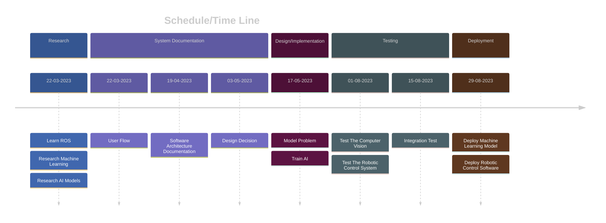

<link rel="stylesheet" href="../styles/styles.css" type="text/css">

<!-- TOC ignore:true -->
# Robot Vision System For A Pick And Place Task
<!--
	Co-Author: @dau501
	Editor(s): @Slothman1, @Huy-GV, @finnmcgearey, @vkach, @NickMcK14
	Year: 2023
-->

`Project Plan`

<!-- TOC ignore:true -->
## Industry Project 24
|Name|Position|Email|
|:-|:-|:-|
|@Slothman1|Team Leader/Client Liaison|id@swin.student.edu.au|
|@dau501|Development Manager/Planning Manager|id@swin.student.edu.au|
|@finnmcgearey|Support Manager/Developer|id@swin.student.edu.au|
|@vkach|Quality Manager/Developer|id@swin.student.edu.au|
|@NickMcK14|Support Manager/Developer|id@swin.student.edu.au|
|@Huy-GV|Quality Manager/Developer|id@swin.student.edu.au|

<!-- page break -->

<!-- TOC ignore:true -->
# DOCUMENT SIGN OFF
|Name|Position|Signature|Date|
|:-|:-|:-|:-|
|@Slothman1|Team Leader/Client Liaison|student_signature(&emsp;)|DD/MM/2023|
|@dau501|Development Manager/Planning Manager|student_signature(&emsp;)|DD/MM/2023|
|@finnmcgearey|Support Manager/Developer|student_signature(&emsp;)|DD/MM/2023|
|@vkach|Quality Manager/Developer|student_signature(&emsp;)|DD/MM/2023|
|@NickMcK14|Support Manager/Developer|student_signature(&emsp;)|DD/MM/2023|
|@Huy-GV|Quality Manager/Developer|student_signature(&emsp;)|DD/MM/2023|

<!-- TOC ignore:true -->
# CLIENT SIGN OFF
|Name|Position|Signature|Date|
|:-|:-|:-|:-|
|@FelipMarti|Research Fellow| |&emsp;/&emsp;/2023|

|Organisation|
|:-|
|Swinburne's Factory of the Future    |

<!-- page break -->

<!-- TOC ignore:true -->
# CONTENTS
<!-- TOC -->

* [INTRODUCTION](#introduction)
	* [Background](#background)
	* [Key Project Personnel](#key-project-personnel)
		* [Client](#client)
		* [Other Stake Holders](#other-stake-holders)
		* [Project Supervisor, Team Leader, and Key Project Members](#project-supervisor-team-leader-and-key-project-members)
* [TERMS OF REFERENCE](#terms-of-reference)
	* [Objectives](#objectives)
	* [Scope](#scope)
	* [Critical Success Factors](#critical-success-factors)
	* [Acceptance Criteria](#acceptance-criteria)
* [ESTABLISHMENT](#establishment)
	* [Processes, Procedures, and Standards](#processes-procedures-and-standards)
	* [Project Environment](#project-environment)
	* [Project Team Skill Development Requirements](#project-team-skill-development-requirements)
* [DELIVERABLES, ACTIVITIES AND CAPITAL RESOURCES](#deliverables-activities-and-capital-resources)
	* [Deliverables](#deliverables)
		* [Software Systems](#software-systems)
		* [Documentation](#documentation)
		* [Hardware Modifications](#hardware-modifications)
	* [Activities](#activities)
		* [Research](#research)
		* [Design and Implementation](#design-and-implementation)
		* [Deployment](#deployment)
		* [Testing](#testing)
		* [System Documentation](#system-documentation)
	* [Resources](#resources)
		* [Hardware Resources](#hardware-resources)
		* [Software Resources](#software-resources)
		* [Human Resources](#human-resources)
		* [Budget](#budget)
* [RISKS](#risks)
* [SCHEDULE](#schedule)
	* [Project Time Line](#project-time-line)
	* [External Dependencies](#external-dependencies)
	* [Assumptions](#assumptions)

<!-- /TOC -->

<!-- page break -->

# INTRODUCTION
The project plan outlined in this document serves as a crucial tool for successful project management.
It provides a clear roadmap, aligns expectations, and fosters effective communication among stakeholders.
By defining objectives, identifying potential risks, and outlining roles and responsibilities, the project plan establishes a solid foundation for project execution.
It also serves as a reference point for tracking progress and evaluating project success, while facilitating future documentation and planning.

## Background
The Factory of the Future (FOF) focuses on developing technologies,
the latest being a cobot that assists an operator assemble devices, which is in need of a vision system.
Currently, the pick and place tasks are only performed under rigidly pre-programmed conditions due to the lack of a perception system.

Specifically, the robot system lacks the ability to detect whether an item is present before moving it onto a tray to be assembled, and
a new perception system is added with the intention of improving this behaviour.

The FOF wants this project to be completed to both show how emerging technologies can be used to automate tasks,
as well as, how robots can be incorporated into regular workflows.
In particular, the addition of a perception system enables the cobot to perform its task more accurately and reduce dependency on the human operator,
leading to heightened productivity.

## Key Project Personnel
The key personnel involve in this project are as follows:

### Client
@FelipMarti is a research fellow within the Factory of the Future.
With a background in IoT he is now working with intelligent robots and computer vision systems.

### Other Stake Holders
S.W: Senior Technical Officer at the Factory of the Future, responsible for designing,
developing and maintaining equipment for safe use and for demonstrations at the Factory of the Future.\
Swinburne clients: potential investors or researchers interested in the technology and wish to view it in progress.\
Swinburne developers: People responsible for the maintaining of the system.\
Prem P.J: The Director of the Factory of the Future.
Prof. J is responsible for leading and overseeing the projects within the Factory of the Future.

### Project Supervisor, Team Leader, and Key Project Members
@Danaclocs: Project Supervisor\
@Slothman1: Team Leader and Client Liaison\
@dau501: Development Manager and Planning Manager\
@finnmcgearey: Support Manager and Developer\
@vkach: Quality Manager and Developer\
@NickMcK14: Support Manager and Developer\
@Huy-GV: Quality Manager and Developer

<!-- page break -->

# TERMS OF REFERENCE
This project will leverage Machine Learning (ML) techniques alongside computer vision;
in tandem with video from the ZED 2 Depth Camera to give the cobot a perception system.\
Currently, the position of the components are defined within the system and the cobot reads these and acts on moving them accordingly.\
The goal of this project is to be able to provide the system with vision, allowing it to autonomously move components around improving efficiency within the system.
Workers will be provided with a more effective workplace as the requirement of grabbing components will be done by the cobot, thus increasing efficiency.

## Objectives
The objectives of this project are to design and implement a vision system for a pick and place task using a robot located within the Factory of the Future.
To achieve this, the following must be achieved:
* Develop a vision system that will enable the robot to locate objects to pick and place, even if they are not in the predefined position.
* The vision system should be able to detect objects accurately and efficiently, and provide the necessary information to the robot's control system.
* The vision system should also be able to detect if objects are missing/out of place and pause until given a command that it is safe to continue.
* The vision system will provide the robot with ample information to perform and subsequently execute its task.

## Scope
The scope of this project includes the development of a vision system that is compatible with the robot's hardware and software.

The following list outlines the capabilities that are in scope of the project, in addition to existing pick-and-place operations of the cobot.
* Detection of components under varying lighting conditions and at different distances that are within reach of the cobot.
* Detection of partially occluded components.
* Detection of absent components and ability to shift to an alternative position.

The following capabilities, including those that may emerge in later stages of the project, are considered to be out of scope.
* Detection of transparent components.
* Detection or manipulation of fallen or mal-oriented components (such components are considered to be absent).
* Detection or manipulation of components that differ from originally established shapes.

<!-- page break -->

## Critical Success Factors
The critical success factors for this project include:
* Developing a vision system that is at least 85% accurate, and reliably works 90% of the time.
* Ensuring that the vision system:
	* is compatible with the robot's hardware and software.
	* can output collected data of detected objects in a variety of lighting conditions and at various distances from the robot.
	* can output collected data of detect objects that are partially occluded or have complex shapes.
* Developing a sophisticated ML model to accurately analyse data and provide correct outputs.
* Developing appropriate code so that the robot can perform movements based on inputted data.

## Acceptance Criteria
The acceptance criteria for this project include:
1. Successful Implementation and Testing of the Vision System.
	* The vision system should be developed and
	integrated into the robot's control system to enable effective performance of pick and place tasks with increased efficiency and accuracy.
2. Accurate and Efficient Object Detection.
	* The vision system should be capable of accurately and
	efficiently detecting objects in a variety of lighting conditions and at various distances from the robot.
3. Handling of Partially Occluded or Complex-Shaped Objects.
	* The system should be able to detect and handle objects that are partially occluded or possess complex shapes,
	ensuring reliable object recognition and manipulation.
4. Detection of Misplaced or Missing Objects.
	* The vision system should have the capability to identify if objects are out of place or missing during the pick and place tasks.
	In such cases, the system should halt the task until instructed to continue.

Additionally, it is important to note that for Semester 1, the client's expectation is focused on research and exploration related to the project,
while the actual implementation of the vision system will take place in Semester 2.

<!-- page break -->

# ESTABLISHMENT
## Processes, Procedures, and Standards
The project team will follow the Kanban methodology for this project as it is a system that easily allows us to monitor our current tasks and
allows for a more independent work style, thus increasing overall productivity.

The Kanban board will have 8 columns: **New**, **Reopened**, **Requested**, **Fix**, **Deploy**, **Merged**, **Closed**, and **Dropped**,
which will be automated by GitHub's (classic) Projects automation features.
The board will serve as the primary source of information for the team's progress,
with each task being represented by a card that will move across the board's columns as it progresses through the project's workflow.

The team will utilize GitHub as the source control system for this project.
All code changes will be submitted via pull requests, and
a team member other than the author will be responsible for reviewing the changes before they are merged into the **main** branch.

All code produced must follow good programming practice, in particular code must follow consistent conventions of naming variables, functions, classes, etc.
(for example camelCase or snake_case).
Clear, concise comments will also be included to help with readability and comprehensibility.

## Project Environment
The project will require the use of various programming languages, frameworks, modules, and development environments to be successfully completed.
The cobot has its own dedicated area in the FoF where development can be performed.
Local data storage will be used rather than any cloud-based storage for security reasons and because of its ease of use.
The following tools and technologies will be utilised throughout the project:
* Robotics lab at the FoF
	* UR5e Collaborative Robot Arm
	* Desktop computer for development, testing, and data storage
* C/C++
* Python
* OpenCV
* PyTorch
* Robot Operating System (ROS2)
* Markdown and CSS
* Ubuntu OS
* Potential IDEs/text editors:
	* Visual Studio
	* Visual Studio Code
	* VIM
	* PyCharm

<!-- page break -->

## Project Team Skill Development Requirements
The project will require knowledge in multiple fields of study to successful deliver the final product;
the team will be required to have expertise in the following areas:
* Computer Vision
	* Collection and labeling of training data.
	* Development of ML models.
	* Manipulation of model parameters to achieve desired outputs.
* Depth Camera
	* Calibration of the camera.
	* Processing and formatting image outputs
* Robotics
	* Development with the ROS2 toolkit
	* Deployment of the software system into the cobot.
* Software Engineering
	* Usage of Python and associated libraries in the areas of ML and CV.
	* Utilisation of C++.
	* Development within Ubuntu.

The team members will be encouraged to attend relevant training sessions and conferences to develop their skills in these areas.
Online tutorials will be helpful references and sources for honing programming capabilities.

<!-- page break -->

# DELIVERABLES, ACTIVITIES AND CAPITAL RESOURCES
## Deliverables
### Software Systems
* Functioning computer vision system satisfying all requirements within scope.
* Functioning robotic control system satisfying all requirements within scope.

### Documentation
* Documents outlining design choices as specified in [System Documentation](#system-documentation).
* Documents detailing test plans as specified in [Testing](#testing).
	* Include simulation test plans and results.
	* Include integration tests and results.

### Hardware Modifications
The workspace contains numerous V-Slot rails that can be used to mount objects for use with the cobot and its environment.
A mounting device compatible with V-Slots will need to be bought or made for the depth camera.
This device will allow the depth camera to be securely mounted to an ideal position in the workspace and capture objects of interest effectively.

## Activities
### Research
During the research phase, the following activities will be undertaken:
1. Learn to use ROS within Ubuntu.
	* Gain proficiency in working with ROS, an open-source framework for building robot applications.\
	This includes understanding its architecture, tools, and how to develop and integrate software components using ROS.
2. Study concepts of machine learning and computer vision.
	* Specifically focusing on computer vision applications, delve into research around machine learning and Artificial intelligence in the field.
	This involves exploring various concepts, algorithms, and techniques used in computer vision, such as image processing, feature extraction, and object detection.
3. Explore the machine learning cycle for the project needs.
	* Investigate the entire machine learning cycle relevant to the project requirements.\
	This includes activities such as:
		* Data collection and labelling:\
		Engage in field work to gather relevant data, labelling it with appropriate annotations.
		* Data pre-processing:\
		Perform necessary preprocessing steps on the collected data to prepare it for feeding into the vision algorithm.
		* Model selection:\
		Explore and evaluate different machine learning models to identify the most suitable choice based on project conditions.
		* Methodology exploration:\
		Investigate and compare different techniques, such as semantic segmentation or object detection,
		to determine which approach is most effective for achieving the desired outcomes.

These research activities will lay the foundation for the subsequent stages of the project,
providing the necessary knowledge and insights to make informed decisions during the implementation phase.

### Design and Implementation
* Model the problem into the software system.
* Train the machine learning model in simulation.

### Deployment
* Deploy the machine learning model in production.
* Deploy the robotic control software into the robot arm.

### Testing
* Test the computer vision system in simulation using a collection of photographs taken in various conditions.
* Test the robotic control system in simulation, covering all identified edge cases.
* Integration test on the robot arm with the control and computer system installed, covering all edge cases as identified in prior simulation tests.

### System Documentation
* User flow documentation: robot behaviors given an input, including explanation for special cases.
* Software architecture documentation: software models, their relationship and interactions.
* Design decision documentation: explanation for software tool/framework and various design choices.
* Installation manual.
* Instruction manual.
* Standard of Practice (SoP).

<!-- page break -->

## Resources
### Hardware Resources
This includes the necessary hardware components for the implementation of the vision system:
* ZED 2 Depth Camera and its mounting tool.
* UR5e robot arm.
* Control tablet for the cobot.
* The assembly line delivering items to the cobot.

The cobot and assembly line are already situated in the FOF.\
The Depth Camera and its mounting tool will be provided by the client, with the team proposing designs for the mounting tool.

### Software Resources
This includes software tools and libraries required for vision system development and integration, such as OpenCV and PyTorch.

### Human Resources
This project will require a team of skilled professionals, including software engineers, computer vision experts, and robotics specialists.

### Budget
A budget will need to be allocated for hardware and software resources, as well as any other project-related expenses.

<!-- page break -->

# RISKS
Risks are a major problem in projects, they can slow things to a grinding halt if not properly dealt with and mitigated.

#### Risk 1
**Difficulty in hardware and software integration.**\
With the project utilising cameras and ROS the integration of hardware and software can lead to issues down the line.\
Regular testing of the software in Ubuntu OS as well as frequent integration with the hardware will avoid major issues.

#### Risk 2
**Inadequate preparation for diverse lighting conditions.**\
In the development of a vision system the prospect of different lighting conditions will arise.\
In the event that the data gathered, and
subsequently used to train the model is unsubstantial in documenting a variety of lighting conditions the system is prone to failure.
Ensuring the data gathered is in a variety of lighting conditions is crucial to ensuring success,
alongside this modifying data to include distortions such as colour variations, misalignment and rotation can help the model work more effectively.

#### Risk 3
**Updates of software.**\
Due to the utilisation of many open-source projects within this project, it is likely a regular update to this software can interfere with the established project.
This could be as minor as efficiency or bug fixes to major issues like mandatory code refactoring or deprecated functions.
Mitigating this issue is difficult as regular software updates are usually beneficial to incorporate; however, maintaining a long term support version may offset this.
Wholly, this issue is difficult to tackle and generally needs to be handled on a case-by-case basis.

#### Risk 4
**Changes in project requirements or objectives.**\
As mentioned above, changes in objectives can change the deadline timing, making it harder to achieve in most cases.
However the larger issue is a change in objectives can change the budget, often demanding a time crunch or stretched resources.\
To mitigate this issue a strong and verbose scope should be established at the beginning of the project,
and moving forward any changes to the scope must include additional modification of the deadlines.

#### Risk 5
**Inadequate communication and collaboration among project team members.**\
In projects, teams often have to be led by a team member.
This leader is responsible for ensuring the work submitted is acceptable.
They are also there to ensure the team is working and collaborating effectively.
If this is not occurring work will be completed at a reduced pace and usually not within the set deadlines.\
Mitigation strategies are having a good leader as well as utilising proper organisation.

#### Risk 6
**Difficulty in sourcing required materials or equipment.**\
As projects grow in size, so too does the cost.
This growing cost is partly due to required materials and equipment.
The risk being that, if for example, the camera was mounted upside down and ordering a replacement part were to take weeks,
do you proceed forward or wait for the  required materials?\
To mitigate this issue multiple tasks should be completed simultaneously so that when equipment becomes available they are used quickly and
effectively to ensure the project is back on track.

#### Risks Associated With This Project
|Rank|Name/Description|Occurrence Probability (H/M/L)|Severity (H/M/L)|Mitigation Strategy Number|Contingency|
|:-:|:-|:-:|:-:|:-:|:-|
|2|Difficulty in hardware and software integration|H|M|1|Revert back to working build, test more frequently from said build.|
|1|Inadequate preparation for diverse lighting conditions.|M|M|2|Take a variety of pics in varying lighting conditions.|
|4|Updates of software.|M|L|3|Create a LTS version of needed software and also keep on top of updates where possible.|
|5|Changes in project requirements or objectives|L|M|4|Change deadlines or task priority to accommodate changes.|
|3|Inadequate communication and collaboration among project team members|M|M|5|Immediately hold a meeting to try and identify issues and implement possible fixes.|
|6|Difficulty in sourcing required materials or equipment|L|M|6|Work with what is currently accessible. Alternatively wait for parts to arrive and continue from there.|

<!-- page break -->

# SCHEDULE
## Project Time Line

<!--  -->

## External Dependencies
* Availability of the UR5e robot arm and required trays
* Collaboration with the client to establish the acceptance criteria and testing requirements
* Availability of technical support and resources from suppliers of required hardware and software

## Assumptions
* All necessary materials and equipment will be available on time
* All key project personnel will be available throughout the project duration
* No major technical issues will arise during the course of the project
* The project team has the required skills to develop the vision system prototype and integrate it with the robot system
* Collaboration with the client will be timely and productive
* The project team will be able to complete the project within the allocated timeline
