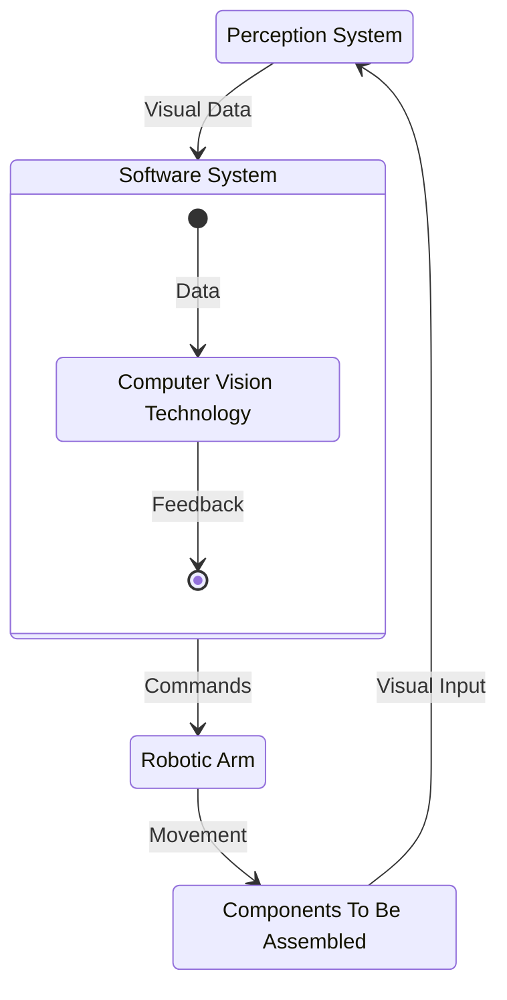
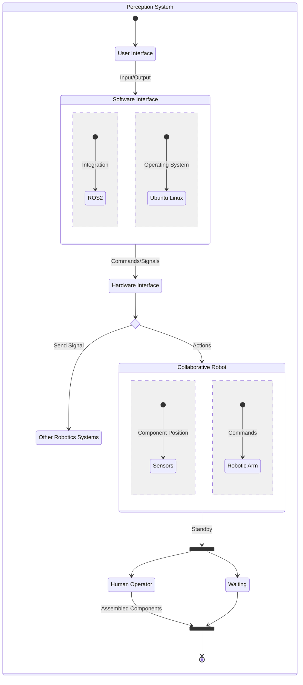

<link rel="stylesheet" href="../styles/styles.css" type="text/css">

# Robot Vision System For A Pick And Place Task
<!--
	Co-Author: @dau501
	Editor(s): @Huy-GV, @Slothman1
	Year: 2023
-->

`System Requirements Specification (SRS)`

## Industry Project 24
|Name|Position|Email|
|:-|:-|:-|
|@Slothman1|Team Leader/Client Liaison|id@swin.student.edu.au|
|@dau501|Development Manager/Planning Manager|id@swin.student.edu.au|
|@finnmcgearey|Support Manager/Developer|id@swin.student.edu.au|
|@vkach|Quality Manager/Developer|id@swin.student.edu.au|
|@NickMcK14|Support Manager/Developer|id@swin.student.edu.au|
|@Huy-GV|Quality Manager/Developer|id@swin.student.edu.au|

<!-- page break -->

# DOCUMENT SIGN OFF
|Name|Position|Signature|Date|
|:-|:-|:-|:-|
|@Slothman1|Team Leader/Client Liaison|student_signature(&emsp;)|DD/MM/2023|
|@dau501|Development Manager/Planning Manager|student_signature(&emsp;)|DD/MM/2023|
|@finnmcgearey|Support Manager/Developer|student_signature(&emsp;)|DD/MM/2023|
|@vkach|Quality Manager/Developer|student_signature(&emsp;)|DD/MM/2023|
|@NickMcK14|Support Manager/Developer|student_signature(&emsp;)|DD/MM/2023|
|@Huy-GV|Quality Manager/Developer|student_signature(&emsp;)|DD/MM/2023|

# CLIENT SIGN OFF
|Name|Position|Signature|Date|
|:-|:-|:-|:-|
|@FelipMarti|Research Fellow| |&emsp;/&emsp;/2023|

|Organisation|
|:-|
|Swinburne's Factory of the Future    |

<!-- page break -->

# Introduction
This project aims to develop and implement a perception system for a collaborative robot (cobot) to perform pick and place tasks.
The cobot is a robotic arm designed to work alongside human workers in the Factory of the Future (FOF).
Its purpose is to assist workers in moving electronics components to different locations autonomously,
thus reducing the workload on human operators and increasing the efficiency of the production line.

Currently, the cobot operates on predefined positions, meaning that it can only perform tasks in specific locations.
This project will enable the cobot to leverage computer vision and artificial intelligence to identify and locate available components,
enabling it to manipulate them autonomously.

The significance of this project lies in its potential to transform the way the manufacturing industry operates.
With the increasing demand for electronic components and the shortage of skilled workers in the field, robotics can help fill the gap by performing repetitive tasks,
allowing human operators to focus on more complex tasks that require decision-making and problem-solving skills.
Additionally, by automating pick and place tasks, the cobot can help reduce human error, increase productivity, and
improve the overall quality of the production line.

In summary, this project aims to develop and implement a perception system that will enable the cobot to identify and locate electronic components, pick them up, and
place them in the desired locations autonomously.
By doing so, it will improve the efficiency of the production line, reduce the workload on human operators, and
help fill the shortage of skilled workers in the manufacturing industry

## Purpose
This SRS document is designed to serve as a roadmap for this project.
It comprehensively outlines the boundaries and requirements of the project to ensure the end product meets the needs of the client.\
Additionally, the document serves as a point of reference for HeeHooVision throughout development cycles,
enabling them to maintain alignment with established standards and requirements.
The client and other stakeholders may use this document as a communication tool that informs them of high-level design details and
verifies that shared objectives are well understood.

## Scope
The project aims to design, develop and implement a perception system for a cobot to perform pick and place tasks at the FOF.
The system will enable the cobot to detect the position of objects that need to be picked up and placed, even if the objects are not in the predefined position.

The systems primary application is to improve the efficiency of pick and place tasks by the cobot at the FOF.
It aims to benefit the company by increasing productivity and working collaboratively with workers.
The objective is to provide the cobot with a perception system that will enable it to perform pick and place tasks accurately, autonomously and efficiently.

The boundaries of the project are as follows:

The system will:
* Develop a real-time perception system for the cobot to perform pick and place tasks autonomously.
* Utilize specialized technologies in CV, Sensors, Robotics, and AI.
* The system will require technical software development skills, specifically in C/C++, Python, OpenCV, PyTorch, and Robot Operating System (ROS2).
* The system should be able to handle various lighting conditions and occlusions to ensure robustness.
* Implement a state-of-the-art vision system that can pick and place objects autonomously when they are needed.
* Provide an end-to-end system for pick and place tasks with the capability to run separately if needed.
* The system should be able to detect and handle abnormal scenarios, such as object slippage and collision detection, to ensure safety and reliability.
* The minimum expectations of the client are that the system is capable of picking and placing objects autonomously in a controlled environment.
* Further exploration is desired in enhancing the system to handle complex and dynamic environments while increasing pick-and-place accuracy and speed.
* Provide a fail-safe mechanism for detecting and handling abnormal scenarios, such as object slippage and collision detection, to ensure safety and reliability.
If the system detects any such abnormal scenarios, it will stop and await human intervention.

The system will not:
* Perform any tasks other than picking and placing objects.
* Handle any tasks that do not require perception systems.
* The perception system will not be a complete replacement for the cobot's existing capabilities and functionalities,
but will instead supplement its capabilities specifically for the task of picking and placing objects.
* Send signals to systems other than the cobot.

## Definitions, Acronyms and Abbreviations
The following definitions will be used consistently throughout the SRS document to ensure clarity and understanding:
* **cobot:**
The mechanical device (UR5e manufactured by Universal Robots) used to perform pick and place tasks.
* **CV/Perception System:**
Computer Vision (CV) is the technology used to provide the robot with visual feedback of the environment.
* **Sensors/Depth Camera:**
The device (ZED 2 Camera developed by Stereolabs) used to detect the presence of objects and provide feedback to the robot.
* **AI:**
Artificial intelligence, the technology used to provide the robot with the ability to learn and improve its performance.
* **OpenCV:**
Open Source Computer Vision Library, a library of programming functions mainly aimed at real-time computer vision.
* **PyTorch:**
An open-source machine learning library based on the Torch library.
* **ROS2:**
Robot Operating System 2, a framework for building robot software applications.
* **SemVer:**
Semantic Versioning, Version Control/Software Versioning Strategy.
* **ML:**
Machine learning, A type of AI where the computer learns.
* **OS:**
Operating System.
* **SRS:**
Software Requirement Specification.
* **Project 24:**
The shorter alternative name of this project.\
The full name is *Robot Vision System For A Pick And Place Task*.
* **FOF:**
Factory of the Future, a Swinburne facility where the cobot is situated.
* **HeeHooVision:**
The name for the Capstone Team working on Project 24
* **ASAP:**
As Soon as Possible
* **COB:**
Close of Business (5:00 PM)

<!-- page break -->

# Overall Description
Project 24 is a new and complete system that aims to provide a cobot with a vision or sensing system to perform pick and place tasks.
Currently, the cobot at the FOF is performing pick and place tasks without any sensing or vision-guided system.\
If the object to pick and place is not in the predefined position, the cobot cannot perform the task.\
This project is significant because it will enable the cobot to perform pick and place tasks more efficiently and accurately than its current method,
which relies on predefined positions.
By providing the cobot with a vision or sensing system, it will be able to detect and locate objects in real-time, which will increase its flexibility and autonomy.

The project requires specialization in CV, Sensors, Robotics, and AI and software programming skills in C/C++, Python, OpenCV, PyTorch, and ROS2.
It will require research into state-of-the-art technologies to provide the cobot with a vision system to pick and place objects.
The project is managed using Kanban and GitHub for implementation and source control.\
The project will also follow SemVer for version control, and the documentation will be in Markdown format.

Project 24 is part of a larger system that revolutionizes the cobot's ability to perform pick and place tasks by integrating cutting-edge technologies.
With a state-of-the-art vision or sensing system, the cobot can detect and analyze objects in real-time.\
This means that it can pick up and place objects more accurately and efficiently than ever before.\
The integration of ROS2 makes the integration of various system components a breeze, making Project 24 a vital step towards the future of robotics.

## Product Features
The system recognises various components from a set of pre-determined locations and
performs a pick-and-place task to transfer them into a common tray for assembly.
The system responds to irregularities such as the absence of certain items in the least disruptive manner possible and
if necessary, stops completely and awaits human intervention.

## System Requirements
Software requirements specify the software required to deploy the system onto the robotic arm and
the depth camera whilst ensuring compatibility with the existing robotic software.\
The development phase involves two programming languages and associated libraries needed to construct said system.
* Production requirements:
	* Ubuntu 22.04 LTS OS.
	* ROS 2 software suite.
* Development requirements:
	* C++ and Python programming languages.
	* CV and AI-related libraries in Python.\
	Potential candidates include PyTorch, OpenCV, etc.

Hardware requirements specify the hardware required to perform the pick-and-place task based on varying visual inputs.
* Universal Robots UR5e robotic arm.
* Depth camera mounted in a manner that captures all relevant items.

## Acceptance Criteria
This section outlines the operation of the robotic arm, as well as the associated depth camera and control software,
which will henceforth be referred to as "the system", under both normal and abnormal conditions.\
Under normal conditions, it is assumed that all items to be manipulated by the robotic arm are located and oriented according to pre-defined parameters.
The acceptance criteria for such conditions are listed below:
* The system picks up different items from a set of pre-defined locations and transfers them to a designated tray.
* The system recognises:
	* items and trays under various lighting conditions.
	* available spaces on the tray and positions items accordingly.
	* trays that have been emptied and returns them to the original position.

The following list specifies the acceptance criteria for conditions considered to be abnormal.\
"Abnormal" in this context refers to items that are absent, misaligned or incorrectly placed on the tray due to external interference.
* The system recognises absent items, in which case it:
	* searches for that item in another location, if available; or
	* stops and awaits human intervention.
* The system detects:
	* incorrect combinations of items on a tray, in which case it stops and awaits human intervention.
	* mal-oriented items, in which case it stops and awaits human intervention.

## Documentation
The software is delivered along with a variety of documents, each designed to serve specific purposes and provide a seamless, user-friendly experience.
These documents vary in scope and details, ranging from high-level tutorials to technical notes.

The following documents are provided with the software package:
* **User Manual:**
provides guidance on how to use offered features, including available best practices.\
It also include guidance on how to troubleshoot errors and perform quick fixes.
* **Installation Manual:**
provides instructions for installing, updating, and uninstalling of the software on supported machines.
* **Release Notes:**
highlights the changes and improvements made in each release of the software.
* **Development Notes:**
provides details about technical information of the software, including its architecture, design, algorithms, training data, etc.
Additionally, the document outlines test plans for the software, including unit tests and integration tests that outline test parameters and desired results.

<!-- page break -->

# Functional Requirements
The system is designed to enable a cobot to identify the objects that need to be picked up and placed.\
To achieve this, the system should have the following functionality:
* **Real-time Object Detection, Processing, and Analysis:**\
The system should be able to handle real-time object detection, processing, and analysis to ensure accuracy and speed.
This involves the use of advanced CV algorithms, such as deep learning networks, to detect and recognize objects in the cobot's environment.
The system should be able to process the detected objects quickly and accurately to enable the cobot to perform its pick and place tasks efficiently.
* **Object Location Data Communication:**\
The system should be able to communicate the object location data to the cobot.
This involves the development of a communication protocol that enables the cobot to receive the location data of the objects that it needs to pick up and place.
The system should be able to communicate this data to the cobot in a format that the cobot can understand and act upon.
* **Continuous Learning and Adaptation:**\
The system should have the ability to continuously learn and adapt to novel objects and locations.
This involves the development of machine learning algorithms that enable the system to learn from its experiences and improve its performance over time.
The system should be able to adapt to new objects and locations by updating its object recognition and location detection algorithms.
* **Autonomous Systems:**\
The system should perform tasks independently without human interaction.
This involves the development of a software architecture that enables the system to operate autonomously, without the need for human intervention.
The system should be able to detect and handle abnormal scenarios, such as object slippage and collision detection.
Alongside this, it should function as an end-to-end system ensuring that human involvement is minimal.

# Non-Functional (Quality) Requirements
Non-functional (quality) requirements are critical to ensure the success of Project 24.
These requirements specify the system's characteristics and
behaviors that are not related to its functionality but contribute to its overall performance and usability.

Here are the non-functional quality requirements for the software architecture and design of Project 24:
* **Reliability:**\
The system should be able to operate without failure for extended periods of time to ensure that the cobot can complete pick and place tasks with minimal pauses.
A failure in this context refers to any instance where the cobot stops and awaits human intervention.\
The reliability requirement should be verifiable by testing the system's performance over a period of time that is,
at a minimum, equivalent to number of hours assembly workers spend in a single day.
The system should also have the ability to handle unexpected conditions and avoid faulting.
* **Modularity:**\
The system should be designed with a modular architecture that facilitates the integration of different CV, sensor, robotics, and AI technologies,
as well as future upgrades and maintenance.
The system should be composed of interchangeable and independent modules, which can be modified or replaced without affecting the functionality of other modules.\
The modularity requirement should be verifiable by testing the system's ability to replace or add modules without causing any impact on the other modules.
This can be implemented by performing unit tests on individual components using stubs and mocks.
* **Security:**\
The system should be designed with security features to prevent unauthorized access, data breaches, and system failures.
Project 24 is responsible for the operation of the cobot in the FOF environment, and
any security vulnerabilities may cause significant damage to the system and its surroundings.
The development process should be iterative, with regular reviews and testing to ensure the non-functional quality requirements are met.\
The security requirement should be verifiable by testing the system's ability to prevent unauthorized access and data breaches.
Communication of the system with external networks should be restricted, traced and closely monitored.
* **Performance:**\
The time spent processing visual inputs by the system should not cause long pauses to the assembly line unless there is external interference.
The system should compute the most efficient sequence of moves to finish a pick-and-place cycle without impacting the human operator and other equipment.\
The requirement should be verifiable by measuring the average system processing time per assembly cycle in all situations,
except those caused by external interference that require human intervention.

<!-- page break -->

# Interface Requirements
Project 24 is designed to be a highly integrated system that works in conjunction with multiple actors.\
At a hardware level, the system is responsible for processing the input from the depth camera and producing commands for the cobot.\
The system's software is responsible for interacting with the existing cobot control system and associated toolkit.

The communication between the CV and the cobot should be seamless, with the system able to send commands to the cobot without any need for human intervention.
This level of automation is achieved through the use of advanced artificial intelligence algorithms, such as ML,
that enable the system to learn from its environment and adapt to changing conditions.

The CV should be highly intuitive and easy to use.\
It should have a simple and user-friendly interface that allows users to quickly configure the system and monitor its operation.\
This interface should be designed to be accessible to users with varying levels of technical expertise,
with clear and concise instructions provided throughout the system.

## System In Context

The cobot system operates within a larger system that includes components such as the hardware interface,
other robotics systems, Ubuntu, robotic arm, and software interface.
The system integrates with ROS2 through the software interface to send commands/signals to the hardware interface for controlling the hardware components.

The hardware interface communicates with the other robotics systems to receive signals and with the cobot to send commands for actions.
The cobot, consisting of sensors for detecting component positions and a robotic arm for executing commands,
can be in a standby state or perform actions based on received signals.

The human operator interacts with the system for assembling components.
The system operates on the Ubuntu, providing the necessary environment for executing commands and integrating with other components.

## User Interfaces
Currently the system already has a GUI and this interface is used to manually override the robots commands.\
With an autonomous system the Robot should not have a GUI, or an advanced one, and in most cases the user shouldn't be modifying this.\
Overall, this Project already has an implemented GUI and we don't need to make/implement one.

## Hardware Interfaces
The software being developed is that of a perception system for a cobot, so the software will integrate with the:
* cobot
* sensors
* other robotics systems, particularly the conveyor belt system, where it should only receive signals
* computer running the software; briefly overviewing how the system interacts is as follows:\
The computer running the software will be almost constantly running, the other robotics systems will send a signal to the software for the cobot.
From here the sensors will identify the location of available components then communicating that information to the cobot to retrieve and place the components.

## Software Interfaces
The software system will interact with ROS2 and Ubuntu systems.
Being a cobot, ROS2 will be the primary software used to integrate with the system, allowing the system to provide the cobot with movement instructions.
ROS2 runs best within Ubuntu systems, as a result the 22.04 LTS version will be used to run ROS2 and be the primary integration with provided hardware in this project.

## Communication Interfaces
For both security and practicality reasons the system will not be connected to a network.
