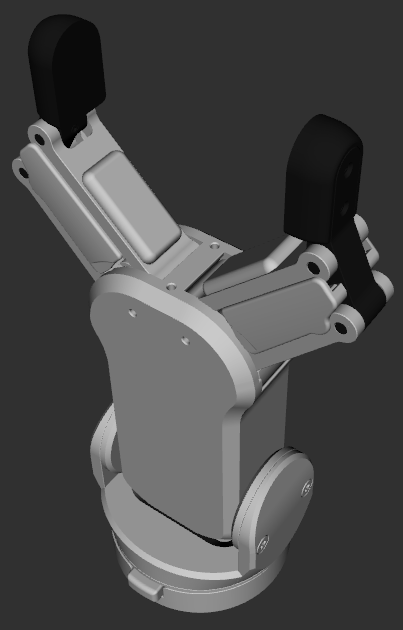
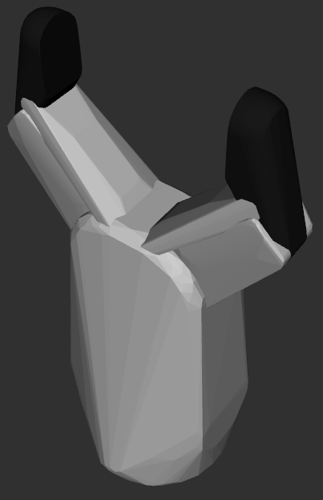

# OnRobot two-fingered gripper
This package contains the URDF files describing OnRobot two-fingered grippers (RG2).
```bash
roslaunch onrobot_rg_description disp_rg2_model.launch
```

## Visual and Collision models
### RG2

&emsp;

## Reference
* To generate a collision model, you can use [rosmodelgen](https://github.com/takuya-ki/rosmodelgen).
